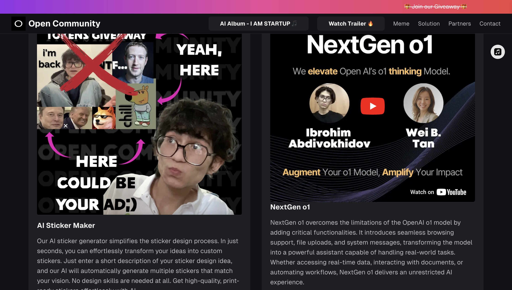

# Building Chat With PDF (e.g., NextGen o1) from Scratch with advanced AI/ML API and integrating Pinecone leading vector database

<details>
<summary>⬇️ Table of Contents ⬇️</summary>

- [Introduction](#introduction)
  - [AI/ML API](#aiml-api)
  - [Pinecone](#pinecone)
  - [Next.js](#nextjs)
  - [Tailwind CSS](#tailwind-css)
- [Prerequisites](#prerequisites)
- [Getting Started](#getting-started)
  - [Create a New Next.js Project](#create-a-new-nextjs-project)
  - [API Routes: `Read Aloud` Feature](#api-routes-read-aloud-feature)
  - [Backend](#backend)
    - [IndexedDB: Temporary Save Audio File](#indexeddb-temporary-save-audio-file)
    - [Pinecone](#pinecone)
    - [Reply Functionality](#reply-functionality)
    - [Server: with ExpressJS](#server-with-expressjs)
  - [Nextgen o1 Interface](#nextgen-o1-interface)
    - [Notification](#notification)
    - [FontAwesome Icons](#fontawesome-icons)
    - [Main Playground](#main-playground)
    - [App Info](#app-info)
    - [Environment Variables](#environment-variables)
  - [Run Locally](#run-locally)
    - [Start the Client](#start-the-client)
    - [Start the Server](#start-the-server)
  - [Testing](#testing)
- [Further Improvements](#further-improvements)
- [Conclusion](#conclusion)
  - [Other Interesting Tutorials](#other-interesting-tutorials)
  - [Try what you have built so far](#try-what-you-have-built-so-far)
- [Bonus](#bonus)


</details>

## Introduction

In this tutorial, we will build Chat With PDF platform from very scratch.

The one that on the right side of the screenshot below: 😂



`TLDR:` The functionality of the platform is really simple. User uploads a PDF file and the platform extracts the text from the whole PDF document and splits it into smaller chunks. Then, all the chunks are indexed in Pinecone, a vector database. Now the user can ask interesting questions. It's very useful for students who want to quickly find the answer to a question in a large PDF document. Kinda preparing for exams or just learning new stuff.

Features:
- upload files and ask questions, advanced data analysis
- get up to date data from internet, web browsing
- read aloud feature, listen to the answers
- reply feature, follow up questions
- sytem prompt, cutomize the model

Chat With PDF (e.g., NextGen o1) is one of the solutions 🦄 that Open Community offers. Check out the [Open Community](https://theopencommunity.co/) website for more information.

So, let's get started! 🚀

### AI/ML API

AI/ML API is a game-changing platform for developers and SaaS entrepreneurs looking to integrate cutting-edge AI capabilities into their products. It offers a single point of access to over 200 state-of-the-art AI models, covering everything from NLP to computer vision.


Key Features for Developers:

* Extensive Model Library: 200+ pre-trained models for rapid prototyping and deployment. 📚
* Customization Options: Fine-tune models to fit your specific use case. 🎯
* Developer-Friendly Integration: RESTful APIs and SDKs for seamless incorporation into your stack. 🛠️
* Serverless Architecture: Focus on coding, not infrastructure management. ☁️

[Get Started for FREE](https://aimlapi.com/?via=ibrohim) 🧑‍🍳

Use the code `IBROHIMXAIMLAPI` for [1 week FREE Access](https://aimlapi.com/?via=ibrohim)

[Deep Dive](https://docs.aimlapi.com/) into AI/ML API Documentation (very detailed, can’t agree more) 📖

Here's a brief tutorial: [How to get API Key from AI/ML API. Quick step-by-step tutorial with screenshots for better understanding.](https://medium.com/@abdibrokhim/how-to-get-api-key-from-ai-ml-api-225a69d0bb25)

### Pinecone

Pinecone is the leading AI infrastructure for building accurate, secure, and scalable AI applications. Use [Pinecone Database](https://docs.pinecone.io/guides/get-started/quickstart) to store and search vector data at scale, or start with [Pinecone Assistant](https://docs.pinecone.io/guides/get-started/assistant-quickstart) to get a RAG application running in minutes.

### Next.js

Next.js is a React framework that enables server-side rendering and static site generation for React applications. It provides a range of features that make it easier to build fast, scalable, and SEO-friendly web applications.

Documentation: [Next.js](https://nextjs.org/docs/getting-started)

### Tailwind CSS

Tailwind CSS is a utility-first CSS framework that makes it easy to build custom designs without writing custom CSS. It provides a range of utility classes that can be used to style elements directly in the HTML.

Documentation: [Tailwind CSS](https://tailwindcss.com/docs)

## Prerequisites

Before we get started, make sure you have the following installed on your machine:

* [Node.js](https://nodejs.org/). Here's a short tutorial on [How to setup Node.js on my computer with ease.](https://medium.com/@abdibrokhim/how-to-setup-node-js-on-my-computer-with-ease-b5fe9b766513)
* [npm or yarn](https://www.npmjs.com/) or [yarn](https://yarnpkg.com/)
* [AI/ML API Key](https://aimlapi.com/?via=ibrohim). Here's a tutorial on [How to get API Key from AI/ML API](https://medium.com/@abdibrokhim/how-to-get-api-key-from-ai-ml-api-225a69d0bb25)
* [Pinecone API Key](https://www.pinecone.io/). Here's a tutorial on [How to get API Key from Pinecone](https://dev.to/abdibrokhim/how-to-get-api-key-from-pinecone-4dlh)

## Getting Started

`Note:` Tutorial could be a little challenging. If you have any questions, feel free to [Book a Call](https://topmate.io/abdibrokhim/). I would love to help you out.

### Create a New Next.js Project

Let's get started by creating a new Next.js project:

```bash
npx create-next-app@latest
```

It will ask you a few *simple questions:

What is your project named? Here, you should enter your app name. For example: `NextGen-o1` (or whatever you wish). For the rest of the questions, simply hit enter:

Here's what you'll see:
```bash
✔ Would you like to use TypeScript? … No / Yes
✔ Would you like to use ESLint? … No / Yes
✔ Would you like to use Tailwind CSS? … No / Yes
✔ Would you like your code inside a `src/` directory? … No / Yes
✔ Would you like to use App Router? (recommended) … No / Yes
✔ Would you like to use Turbopack for `next dev`? … No / Yes
✔ Would you like to customize the import alias (`@/*` by default)? … No / Yes
```

Open your project with Visual Studio Code:

```bash
cd NextGen-o1
code .
```

### API Routes: `Read Aloud` Feature

The first thing first, let's deal with API routes.

Create a new folder called `api` in the root of your project. Inside the `api` folder, create `text-to-speech` folder and `route.ts` file. Open the `route.ts` file and add the following code:

```typescript
// api/text-to-speech/route.ts

import { NextResponse } from 'next/server';

export async function POST(request: Request) {
  try {
    console.log('POST /api/text-to-speech');
    // Extract the text from the incoming request body
    const { text } = await request.json();
    console.log('user input:', text);

    if (!text || text.length === 0) {
      return NextResponse.json({ message: 'No text provided' }, { status: 400 });
    }

    const apiKey = process.env.NEXT_PUBLIC_AIML_API_KEY;

    const apiResponse = await fetch('https://api.aimlapi.com/tts', {
      method: 'POST',
      headers: {
        'Content-Type': 'application/json',
        'Authorization': `Bearer ${apiKey}`,
      },
      body: JSON.stringify({
        model: '#g1_aura-asteria-en',
        text: text
      })
    });

    if (!apiResponse.ok) {
      const errorData = await apiResponse.json();
      return NextResponse.json(
        { message: errorData.message || 'Failed to fetch from Aura' },
        { status: apiResponse.status }
      );
    }

    // Get the audio response as a blob
    const audioBlob = await apiResponse.blob();
    const arrayBuffer = await audioBlob.arrayBuffer();

    // Return the binary audio file in the response
    return new NextResponse(arrayBuffer, {
      status: 200,
      headers: {
        'Content-Type': 'audio/mpeg',
        'Content-Disposition': 'attachment; filename="audio.mp3"',
      },
    });
  } catch (error: any) {
    console.error('Error in /api/text-to-speech:', error);
    return NextResponse.json(
      { error: error.message || 'Internal Server Error' },
      { status: 500 }
    );
  }
}
```


### Backend

#### IndexedDB: Temporary Save Audio File

Next, we should temporarily save the `audio file` to play it later. So, the easiest way is thro using `IndexedDB`. Let's create a new file called `indexdb.js` in the `backend/utils` folder:


```javascript
// Function to open IndexedDB
export const openDatabase = () => {
    return new Promise((resolve, reject) => {
        const request = indexedDB.open('textDatabase', 1);
        request.onupgradeneeded = (event) => {
            const db = event.target.result;
            db.createObjectStore('texts', { keyPath: 'id' });
        };
        request.onsuccess = (event) => {
            resolve(event.target.result);
        };
        request.onerror = (event) => {
            reject(event.target.error);
        };
    });
}

// Function to save text to IndexedDB
export const saveTextToIndexedDB = (db, id, text) => {
    return new Promise((resolve, reject) => {
        const transaction = db.transaction(['texts'], 'readwrite');
        const store = transaction.objectStore('texts');
        const request = store.put({ id: id, text: text });
        request.onsuccess = () => {
            resolve();
        };
        request.onerror = (event) => {
            reject(event.target.error);
        };
    });
}

// Function to get text from IndexedDB
export const getTextFromIndexedDB = (db, id) => {
    return new Promise((resolve, reject) => {
        const transaction = db.transaction(['texts'], 'readonly');
        const store = transaction.objectStore('texts');
        const request = store.get(id);
        request.onsuccess = (event) => {
            if (request.result) {
                resolve(request.result.text);
            } else {
                reject('Text not found in IndexedDB');
            }
        };
        request.onerror = (event) => {
            reject(event.target.error);
        };
    });
}

// Function to delete text from IndexedDB
export const deleteTextFromIndexedDB = (db, id) => {
    return new Promise((resolve, reject) => {
        const transaction = db.transaction(['texts'], 'readwrite');
        const store = transaction.objectStore('texts');
        const request = store.delete(id);
        request.onsuccess = () => {
            resolve();
        };
        request.onerror = (event) => {
            reject(event.target.error);
        };
    });
}

// IndexedDB Utility Functions
export const openVoiceDatabase = async () => {
    return new Promise((resolve, reject) => {
      const request = indexedDB.open('audioDatabase', 1);
      request.onupgradeneeded = (event) => {
        const db = event.target.result;
        db.createObjectStore('audios', { keyPath: 'id' });
      };
      request.onsuccess = (event) => {
        resolve(event.target.result);
      };
      request.onerror = (event) => {
        reject(event.target.error);
      };
    });
  }
  
export const saveAndPlayAudio = async (blob) => {
    const db = await openVoiceDatabase();
    const audioId = 'audio_' + Date.now();
  
    // Save to IndexedDB
    await new Promise((resolve, reject) => {
      const transaction = db.transaction(['audios'], 'readwrite');
      const store = transaction.objectStore('audios');
      const request = store.put({ id: audioId, audio: blob });
      request.onsuccess = () => resolve();
      request.onerror = (event) => reject(event.target.error);
    });
  
    // Create URL and play
    const audioURL = URL.createObjectURL(blob);
    const audio = new Audio(audioURL);
    audio.play();
  
    // Cleanup after playback
    audio.addEventListener('ended', async () => {
      URL.revokeObjectURL(audioURL);
      const transaction = db.transaction(['audios'], 'readwrite');
      const store = transaction.objectStore('audios');
      store.delete(audioId);
      console.log('Audio deleted from IndexedDB after playback.');
    });
}
```


If you want more tutorials with `IndexedDB` and `text-to-speech` stuff. Kindly check this tutorial: [Building a Chrome Extension from Scratch with AI/ML API, Deepgram Aura, and IndexedDB Integration](https://dev.to/abdibrokhim/building-a-chrome-extension-from-scratch-with-aiml-api-deepgram-aura-and-indexeddb-integration-25hd)


#### Pinecone

Let's quickly setup Pinecone vector database. Enter the `utils` folder again. And create `create.js`, `update.js`, and `query.js` files. 
- `create.js` file will initialize unique index inside Pinecone vector database.
- `update.js` file will update the vector database with new data (e.g., PDF document contents).
- `query.js` file will query the vector database with user's questions.

Open `create.js` and add following code:

```javascript
export const createDoc = async (
    client,
    indexName,
    vectorDimension
  ) => {
    // 1. Initiate index existence check
    console.log(`Checking "${indexName}"...`);
  
    try {
      // 2. Get list of existing indexes
      const response = await client.listIndexes();
  
      // Log the result to check its type
      console.log("Existing indexes:", response);

      // Extract the indexes array from the response object
        const existingIndexes = response.indexes || [];

        // 3. Check if the index exists in the extracted array
        const indexExists = existingIndexes.some(index => index.name === indexName);
  
      // 3. Check if the result is an array
      if (!indexExists) {
        // 4. If index doesn't exist, create it
        if (!existingIndexes.includes(indexName)) {
          console.log(`Creating "${indexName}"...`);
  
          // 5. Create index
          const createClient = await client.createIndex(
            {
              name: indexName,
              dimension: vectorDimension,
              metric: "cosine",
              spec: { serverless: { cloud: 'aws', region: 'us-east-1' }},
            },
          );
  
          // 6. Log successful creation
          console.log(`Created with client:`, createClient);
  
          // 7. Wait 60 seconds for index initialization
          await new Promise((resolve) => setTimeout(resolve, 60000));

          // 8. Return indexName on successful creation
            return indexName;
        } else {
          // 8. Log if index already exists
          console.log(`"${indexName}" already exists.`);

            // 9. Return indexName if already exists
            return indexName;
        }
      } else {
        console.error("Unexpected return type from listIndexes:", typeof existingIndexes);
        throw new Error("listIndexes did not return an array");
      }
    } catch (error) {
      console.error("Error creating or checking index:", error);
    }
};
```

Open `update.js` and add following code:

```javascript
// 1. Import required modules
import { OpenAIEmbeddings } from "@langchain/openai";
import { RecursiveCharacterTextSplitter } from "langchain/text_splitter";
// 2. Export updatePinecone function
export const updateDoc = async (client, indexName, docs) => {
  console.log("Retrieving Pinecone index...");
// 3. Retrieve Pinecone index
  const index = client.Index(indexName);
// 4. Log the retrieved index name
  console.log(`Pinecone index retrieved: ${indexName}`);
// 5. Process each document in the docs array
  for (const doc of docs) {
    console.log(`Processing document: ${doc.metadata.source}`);
    const txtPath = doc.metadata.source;
    const text = doc.pageContent;
// 6. Create RecursiveCharacterTextSplitter instance
    const textSplitter = new RecursiveCharacterTextSplitter({
      chunkSize: 1000,
    });
    console.log("Splitting text into chunks...");
// 7. Split text into chunks (documents)
    const chunks = await textSplitter.createDocuments([text]);
    console.log(`Text split into ${chunks.length} chunks`);
    console.log(
      `Calling OpenAI's Embedding endpoint documents with ${chunks.length} text chunks ...`
    );
// 8. Create OpenAI embeddings for documents
    const embeddingsArrays = await new OpenAIEmbeddings({
        apiKey: "",
        batchSize: 512,
        model: "text-embedding-3-large",
      }).embedDocuments(
      chunks.map((chunk) => chunk.pageContent.replace(/\n/g, " "))
    );
    console.log("Finished embedding documents");
    console.log(
      `Creating ${chunks.length} vectors array with id, values, and metadata...`
    );
// 9. Create and upsert vectors in batches of 100
    const batchSize = 100;
    let batch = [];
    for (let idx = 0; idx < chunks.length; idx++) {
      const chunk = chunks[idx];
      const vector = {
        id: `${txtPath}_${idx}`,
        values: embeddingsArrays[idx],
        metadata: {
          ...chunk.metadata,
          loc: JSON.stringify(chunk.metadata.loc),
          pageContent: chunk.pageContent,
          txtPath: txtPath,
        },
      };
      batch.push(vector);
      // When batch is full or it's the last item, upsert the vectors
      if (batch.length === batchSize || idx === chunks.length - 1) {
        await index.upsert(batch);
        // Empty the batch
        batch = [];
      }
    }
// 10. Log the number of vectors updated
    console.log(`Pinecone index updated with ${chunks.length} vectors`);
  }
};
```

Open `query.js` and add following code:

```javascript
import { ChatOpenAI, OpenAIEmbeddings } from "@langchain/openai";
import { loadQAStuffChain } from "langchain/chains";
import { Document } from "langchain/document";
import OpenAI from "openai";

export const queryDoc = async (
  client,
  indexName,
  question
) => {
  console.log("Querying Pinecone vector store...");
  
  const index = client.Index(indexName);

  // Generate the query embedding
  const queryEmbedding = await new OpenAIEmbeddings({
    apiKey: "",
    batchSize: 512,
    model: "text-embedding-3-large",
  }).embedQuery(question);

//   console.log(queryEmbedding);

  // Make the query to Pinecone
  let queryResponse = await index.query({
    topK: 10,
    vector: queryEmbedding,
    includeMetadata: true,
    includeValues: true,
  });

  console.log(`Found ${queryResponse.matches.length} matches...`);
  console.log(`Asking question: ${question}...`);

  if (queryResponse.matches.length) {
    const llm = new ChatOpenAI({
      apiKey: "",
      model: "gpt-4o",
    });

    const chain = loadQAStuffChain(llm);
    const concatenatedPageContent = queryResponse.matches
      .map((match) => match.metadata.pageContent)
      .join(" ");
    
    const result = await chain.call({
      input_documents: [new Document({ pageContent: concatenatedPageContent })],
      question: question,
    });

    console.log(`Answer: ${result.text}`);
    return result.text;
  } else {
    console.log("No matches found, GPT-3 will not be queried.");
  }
};
```

#### Reply Functionality

Let's now implement `reply` functionality within the chat. For example: user can select specific text and ask follow-up questions. Create and open `chat.js` and add the following code:

```javascript
export const chatCompletion = async (prompt, replyText) => {
  console.log("loading chatCompletion...");

  const systemPrompt = "You are a helpful assistant that provides useful information to people in need. Your answer should be concise and informative.";

  try {
        const response = await fetch("https://api.aimlapi.com/chat/completions", {
            method: "POST",
            headers: {
                Authorization: "Bearer ",
                "Content-Type": "application/json",
            },
            body: JSON.stringify({
                model: "gpt-4o",
                messages: [
                    {
                        role: "system",
                        content: systemPrompt,
                    },
                    {
                        role: "user",
                        content: "[QUOTE]"+replyText+"\n\n[QUERY]"+prompt,
                    },
                ],
                max_tokens: 512,
            }),
        });

        const data = await response.json();

        console.log("data: ", data);

        console.log("data.choices[0].message.content: ", data.choices[0].message.content);

        // Return the assistant's message content
        return data.choices[0].message.content;
    } catch (error) {
        console.error("Error fetching the data:", error);
        return "An error occurred while fetching the data.";
    }
}
```


#### Server: with ExpressJS

Let's create a new file called `app.js` in the `backend` folder. Open the `app.js` file.

First import the required modules:

```javascript
import express from 'express';
import { Pinecone as PineconeClient } from "@pinecone-database/pinecone";
import { PDFLoader } from "@langchain/community/document_loaders/fs/pdf";
import { createDoc } from "./utils/create.js";
import { updateDoc } from "./utils/update.js";
import { queryDoc } from "./utils/query.js";
import { gptoOne } from "./utils/gptoone.js";
import { webBrowser } from "./utils/browse.js";
import { chatCompletion } from "./utils/chat.js";
import { evalIt } from "./utils/evaluate.js";
import { v4 as uuidv4 } from 'uuid';
import cors from 'cors';
import multer from 'multer';
```

Initialize the Express app:

```javascript

const app = express();

// Enable CORS for all routes
app.use(cors());

app.use(express.json());
```

Next, we will define the routes for creating, updating, and querying the Pinecone index:

`Create` index with unique index name and vector dimension:

```javascript

const client = new PineconeClient({
  apiKey: "",
});

app.post('/api/createIndex', async (req, res) => {
  try {
    const { indexName, vectorDimension } = { "indexName": uuidv4(), "vectorDimension": 3072 };
    await createDoc(client, indexName, vectorDimension);
    res.status(200).json({ message: 'Index created successfully', indexName });
  } catch (error) {
    res.status(500).json({ error: error.message });
  }
});
```

`Update` index with PDF document contents:

```javascript

// Set up multer for file uploads
const upload = multer({ dest: 'uploads/' });

app.post('/api/updateIndex', upload.single('file'), async (req, res) => {
  try {
    console.log('Request body:', req.body);
    console.log('Uploaded file details:', req.file);

    const { indexName } = req.body;

    if (!req.file) {
      throw new Error('File upload failed or file is missing');
    }

    const pdfPath = req.file.path;
    console.log('Processing file at path:', pdfPath);

    const loader = new PDFLoader(pdfPath);
    const docs = await loader.load();
    console.log('Document loaded:', docs);

    await updateDoc(client, indexName, docs);
    res.status(200).json({ message: 'Index updated successfully' });
  } catch (error) {
    console.error('Error processing file upload:', error);
    res.status(500).json({ error: error.message });
  }
});
```

`Query` index with user's question:

```javascript

app.post('/api/queryIndex', async (req, res) => {
  try {
    const { indexName, question, systemPrompt } = req.body;
    const answer = await queryDoc(client, indexName, question);
    // check whether gpt could answer the question, otherwise use web search
    const n = await evalIt(answer);
    // parse n to integer
    if (parseInt(n) === 0) {
      const newAnswer = "Could not find the information from uploaded document. I will try to search the web for you.";
      res.status(200).json({ newAnswer, n: 0 });
    } else {
      const newAnswer = await gptoOne(answer, systemPrompt);
      res.status(200).json({ newAnswer, n: 1 });
    }
  } catch (error) {
    res.status(500).json({ error: error.message });
  }
});

```

Web search:

```javascript

app.post('/api/webSearch', async (req, res) => {
  try {
    const { query, systemPrompt } = req.body;
    const answer = await webBrowser(query);
    const newAnswer = await gptoOne(answer, systemPrompt);
    res.status(200).json({ newAnswer });
  } catch (error) {
    res.status(500).json({ error: error.message });
  }
});

```

`Chat` for follow-up questions:

```javascript

app.post('/api/chat', async (req, res) => {
  try {
    const { question, sReplyText } = req.body;
    const answer = await chatCompletion(question, sReplyText);
    res.status(200).json({ answer });
  } catch (error) {
    res.status(500).json({ error: error.message });
  }
});
```


Finally, start the server:

```javascript
const PORT = process.env.PORT || 3001;
app.listen(PORT, () => {
  console.log(`Server is running on port ${PORT}`);
});
```

If you have any questions, feel free to [Book a Call](https://topmate.io/abdibrokhim/). I would love to help you out.

### Nextgen o1 Interface

Let's setup the notification:

#### Notification

Open `page.tsx` and delete everything. Then add the following code:

```typescript
'use client';

import React, { useState, useRef, useEffect } from 'react';
import Notification from './notify';

const [notification, setNotification] = useState<{ message: string; type: 'error' | 'success' |'info' } | null>(null);  // notification message

export default function Home() {
    return (
        <main className="flex min-h-screen flex-col justify-between">
            {notification && (
            <Notification
                message={notification.message}
                type={notification.type}
                onClose={() => setNotification(null)}
            />
            )}
            // rest of the code. we'll implement next
        </main>
    );
}
```

Then, create a new file `notify.tsx` in the same level and put this;

```typescript
import React, { useEffect } from 'react';

type NotificationProps = {
  message: string;
  type: 'error' | 'success' | 'info';
  onClose: () => void;
};

const Notification: React.FC<NotificationProps> = ({ message, type, onClose }) => {
  useEffect(() => {
    const timer = setTimeout(() => {
      onClose();
    }, 3000); // Auto-close after 3 seconds
    return () => clearTimeout(timer);
  }, [onClose]);

  const bgColor = type === 'error' ? 'bg-red-500' : type === 'success' ? 'bg-green-500' : 'bg-blue-500';

  return (
    <div className={`fixed top-10 left-1/2 transform -translate-x-1/2 ${bgColor} text-white px-4 py-2 rounded-md shadow-lg z-50`}>
      <p>{message}</p>
    </div>
  );
};

export default Notification;
```

Simple yet nice notification card.


#### FontAwesome Icons

If you closely look at the code, we are using `Font Awesome` icons. They are so nice. [Learn more](https://docs.fontawesome.com/web/use-with/react). Install it by running the following command:

```bash
npm i --save @fortawesome/fontawesome-svg-core

npm i --save @fortawesome/free-solid-svg-icons
npm i --save @fortawesome/free-regular-svg-icons
npm i --save @fortawesome/free-brands-svg-icons

npm i --save @fortawesome/react-fontawesome@latest
```

Well, okey! Let's build the UI for the PrepAlly interface. 

Import icons:

```typescript
import { faAdd, faArrowUp, faClose, faCoffee, faFilePdf, faGear, faRotateRight, faShower, faThumbTack } from '@fortawesome/free-solid-svg-icons';
import { faGithub, faLinkedin } from '@fortawesome/free-brands-svg-icons';
import { FontAwesomeIcon } from '@fortawesome/react-fontawesome';

return (

//   rest of the code
// after notification component
// all the buttons aligned on the left side at the top

<div className='flex flex-col gap-4 fixed top-4 left-4'>
        <div className="relative flex items-center group">
          <button
            onClick={startOver}
            className="flex items-center justify-center w-10 h-10 rounded-full bg-[#eeeeee] text-black shadow cursor-pointer "
            >
            <FontAwesomeIcon icon={faRotateRight} />
          </button>
          <span className="absolute w-[80px] text-xs left-full ml-4 opacity-0 group-hover:opacity-100 transition-opacity duration-500 rounded-md bg-[#eeeeee] text-black px-2 py-1 before:content-[''] before:absolute before:right-full before:top-1/2 before:transform before:-translate-y-1/2 before:border-4 before:border-transparent before:border-r-[#eeeeee]">
            Start over
          </span>
        </div>
        <div className="relative flex items-center group">
          <button
            onClick={cleanChat}
            className="flex items-center justify-center w-10 h-10 rounded-full bg-[#eeeeee] text-black shadow cursor-pointer "
            >
            <FontAwesomeIcon icon={faShower} />
          </button>
          <span className="absolute w-[80px] text-xs left-full ml-4 opacity-0 group-hover:opacity-100 transition-opacity duration-500 rounded-md bg-[#eeeeee] text-black px-2 py-1 before:content-[''] before:absolute before:right-full before:top-1/2 before:transform before:-translate-y-1/2 before:border-4 before:border-transparent before:border-r-[#eeeeee]">
            Clear chat
          </span>
        </div>
        <div className="relative flex items-center group">
          <button
            onClick={setUp}
            className="flex items-center justify-center w-10 h-10 rounded-full bg-[#eeeeee] text-black shadow cursor-pointer "
            >
            <FontAwesomeIcon icon={faGear} />
          </button>
          <span className="absolute w-[80px] text-xs left-full ml-4 opacity-0 group-hover:opacity-100 transition-opacity duration-500 rounded-md bg-[#eeeeee] text-black px-2 py-1 before:content-[''] before:absolute before:right-full before:top-1/2 before:transform before:-translate-y-1/2 before:border-4 before:border-transparent before:border-r-[#eeeeee]">
            Set up
          </span>
        </div>
      </div>
    //   rest of the code
);
```

It results something similar to this:


Implement functions:

```typescript
//   rest of the code
const [showSetUpWindow, setShowSetUpWindow] = useState(false);
  const [isSavingSetUp, setIsSavingSetUp] = useState(false);
  const [systemPrompt, setSystemPrompt] = useState('');
  const [isMemoryOn, setIsMemoryOn] = useState(false);
//   rest of the code

const startOver = () => {
    console.log('Starting over...');
    console.log('initializing...');
    setMessages([{ sender: 'bot', text: 'Hello! How can I assist you today?', type: 'answer' }]);
    setInput('');
    setLoading(false);
    setProcessing(false);
    setShowFileWindow(false);
    setSelectedFile(null);
    setValidated(false);
    setFileName('');
    setIndexName('');
  }

//   we will add all states in the next steps

  const cleanChat = () => {
    console.log('Cleaning chat...');
    setMessages([{ sender: 'bot', text: 'Hello! How can I assist you today?', type: 'answer' }]);
    setInput('');
  }

  const setUp = () => {
    console.log('Setting up...');
    setShowSetUpWindow(true);
  };


return (
  //   rest of the code

  {showSetUpWindow && (
    <div className="fixed inset-0 flex items-center justify-center bg-black bg-opacity-50 z-40">
        <div className="bg-[#2e2e2e] rounded-lg shadow-lg max-w-[800px] max-h-[600px] p-2">
            <SetUpWindow 
                onClose={() => setShowSetUpWindow(false)}
                onSave={() => setSystemPromptToLocalStorage()}
                systemPrompt={systemPrompt}
                setSystemPrompt={setSystemPrompt}
                isMemoryOn={isMemoryOn}
                setIsMemoryOn={setIsMemoryOn}
            />
        </div>
    </div>
)}
//   rest of the code, chat messages field
);

```

System prompt setup pop window. It should be written inside `Home` component:

```typescript
//   rest of the code
const newTextareaRef = useRef<HTMLTextAreaElement>(null);
//   rest of the code

// SetUpWindow Component
const SetUpWindow = ({ onClose, onSave, systemPrompt, setSystemPrompt, isMemoryOn, setIsMemoryOn }: any) => {
  return (
      <div className="relative w-[800px] flex flex-col gap-4 p-4">
          {/* Close Button */}
          <div className='text-white text-md'>Setup settings</div>
          <button
              onClick={onClose}
              className={`flex items-center justify-center w-10 h-10 rounded-full shadow cursor-pointer bg-[#eeeeee] text-black absolute top-2 right-4`}>
              {!isSavingSetUp 
                  ? <FontAwesomeIcon icon={faClose} />
                  : <span className='flex justify-center items-center text-black'>{loader()}</span>
              }
          </button>

          {/* Content */}
          <div className="flex flex-col gap-4 pt-12">
              {/* Textarea for system prompt */}
              <span className="text-white text-sm">System Prompt</span>
              <textarea
                  tabIndex={0}
                  ref={newTextareaRef}
                  value={systemPrompt}
                  onChange={(e) => setSystemPrompt(e.target.value)}
                  rows={5}
                  className="p-2 border rounded-md border-gray-300 bg-white text-black outline-none"
                  placeholder="Enter your system prompt here..."
              />

              {/* Checkbox for memory option */}
              <label className="flex items-center">
                  <input
                      type="checkbox"
                      checked={isMemoryOn}
                      onChange={() => setIsMemoryOn(!isMemoryOn)}
                      className="mr-2"
                  />
                  <span className="text-white text-sm">Enable Web Search</span>
              </label>

              {/* Save Button */}
              <button 
                  disabled={isSavingSetUp}
                  onClick={onSave} 
                  className="bg-[#eeeeee] text-black p-2 rounded-md w-full font-bold">
                  {!isSavingSetUp 
                      ? <span className='flex justify-center items-center text-black'>Save</span>
                      : <span className='flex justify-center items-center text-black'>{loader()}</span>
                  }
              </button>
          </div>
      </div>
  );
};
//   rest of the code
```


#### Main Playground

Next, let's design the main playground. tbh; we need just one `input field` (e.g., textarea) and a couple of buttons; one to select and upload file, second to send a message.

Implement functions and states accordingly:

```typescript

    //   rest of the code
    const [input, setInput] = useState('');
    const [loading, setLoading] = useState(false);
    const [replying, setReplying] = useState(false);
const [showFileWindow, setShowFileWindow] = useState(false);
const textareaRef = useRef<HTMLTextAreaElement>(null);

const [messages, setMessages] = useState([]);

// example: uncomment below and comment above one to see how chat messages will reflect on UI.

// const [messages, setMessages] = useState([
//     { sender: 'bot', text: 'Hello! How can I assist you today?', type: 'answer' },
//     { sender: 'bot', text: `Deep Learning (DL) is a subset of machine learning that involves neural networks with multiple layers. It has significantly impacted various fields, including medical imaging, natural language processing, and computer vision. Deep Learning models have the ability to learn complex patterns and representations in data, which has led to advancements in automation, data analysis, and predictions.

// In the medical field, DL is used for tasks such as brain biomarker interpretation, medical image segmentation, and cancer prediction through histology images. It also improves cybersecurity through threat detection models that incorporate domain knowledge. Moreover, DL techniques are being studied for their interpretability, with methods developed to better explain predictions and learning processes to users.

// Future research in DL may focus on enhancing model interpretability, incorporating domain-specific knowledge to improve model accuracy, and tackling challenges like adversarial attacks. These advancements hold the potential to drive further technological and societal growth.`, type: 'answer' }, 
//   ]);
//   rest of the code

const handleInput = (e: any) => {
    setInput(e.target.value);
    adjustTextareaHeight();
  };

  const adjustTextareaHeight = () => {
    const textarea = textareaRef.current;
    if (textarea) {
      textarea.style.height = 'auto';
      textarea.style.height = `${Math.min(textarea.scrollHeight, 128)}px`;
    }
  };

  const handleKeyDown = (e: any) => {
    if (e.key === 'Enter' && !e.shiftKey) {
      e.preventDefault();
      if (validated) {
        setMessages(prev => [...prev, { sender: 'user', text: input , type: 'query'}]);
        handleSendMessage();
      } else {
        setMessages(prev => [...prev, { sender: 'user', text: input, type: 'query' }]); 
        chatCompletion();
      }
    }
  };

  useEffect(() => {
    adjustTextareaHeight();
  }, [input]);

  //   rest of the code
```

Return statement:

```typescript
return (
//   rest of the code
<div className="w-[80%] lg:max-w-5xl mx-auto flex items-center p-2 mb-8 fixed bottom-0 left-0 right-0 shadow-lg gap-4 bg-[#2e2e2e] rounded-full">
        <button
          disabled={loading}
          onClick={() => setShowFileWindow(!showFileWindow)}
          className={`flex items-center justify-center w-10 h-10 rounded-full bg-[#4e4e4e] text-black shadow ${
            loading ? 'cursor-not-allowed' : 'cursor-pointer'}`}
        >
          {!loading 
            ? <FontAwesomeIcon icon={faAdd} />
            : <span className='flex justify-center items-center text-white'>{loader()}</span>
          }
        </button>
        <textarea
          tabIndex={0}
          ref={textareaRef}
          className="flex-1 resize-none border-none focus:ring-0 outline-none bg-transparent text-white"
          placeholder="Type your message..."
          value={input}
          onChange={handleInput}
          onKeyDown={handleKeyDown}
          style={{ minHeight: '24px', maxHeight: '128px' }}
        />
        <button
          disabled={loading || input === ''}
          onClick={!replying ? handleSendMessage : chatCompletion}
          className={`flex items-center justify-center w-10 h-10 rounded-full shadow ${
            loading || input === '' ? 'cursor-not-allowed bg-[#4e4e4e] text-black'  : 'cursor-pointer bg-[#eeeeee] text-black'}`}
        >
          {!loading 
            ? <FontAwesomeIcon icon={faArrowUp} />
            : <span className='flex justify-center items-center text-white'>{loader()}</span>
          }
        </button>
        {showFileWindow && (
          <div className="absolute left-0 top-[-150px] mt-8 w-72 p-2 bg-[#2e2e2e] text-white text-sm rounded shadow-md z-50">
            <div>
              <div className='flex gap-3 p-2 items-center'>
                <FontAwesomeIcon icon={faThumbTack} />
                <div className="flex items-center">
                  Current file: 
                  {selectedFile ? (
                    <>
                      {processing 
                        ? <span className='ml-8 flex justify-center items-center'>{loader()}</span>
                        : validated 
                          ? <span className='ml-1 bg-[#4e4e4e] p-1 rounded'>{getFileName()}</span>
                          : 'Error'
                      }
                    </>
                  ) : (<span className='ml-8'>...</span>)}
                </div>
              </div>
              <div className='flex m-auto items-center justify-center w-64 h-[1px] bg-[#4e4e4e]'></div>
              <label
                htmlFor="fileInput"
                className="mt-2 flex p-2 items-center gap-3 rounded-md hover:bg-[#4e4e4e] transition-colors duration-200 text-white cursor-pointer text-sm flex-shrink-0"
              >
                <FontAwesomeIcon icon={faFilePdf} />
                <span>Upload from computer</span>
                <input
                  id="fileInput"
                  type="file"
                  className="hidden"
                  onChange={handleFileChange}
                />
              </label>
            </div>
          </div>
        )}
      </div>
// </main>
);

```


Messages:

```typescript
// import markdown
import ReactMarkdown from 'react-markdown';

//   rest of the code
<div className="w-full lg:max-w-5xl px-16 lg:px-0 mx-auto">
        <div className="mb-32 w-full lg:text-left overflow-auto">
          <div className="overflow-y-auto flex-1 p-4">
          {messages.map((message, index) => (
  <div
    key={index}
    className={`p-4 mb-2 rounded-lg ${
      message.sender === 'bot' ? 'bg-[#1e1e1e]' : message.type === 'reply' ? 'bg-none' : 'bg-[#2e2e2e]'
    } text-white max-w-full`}
  >
    {message.type === 'reply' && (
      <div className="text-xs p-2 mb-2 truncate">
        <span className='text-sm'>Replying:</span> {message.text}
      </div>
    )}

    <ReactMarkdown
      components={{
        a: ({ node, ...props }) => (
          <a className="text-blue-800 cursor-pointer" {...props} />
        ),
      }}
    >
      {message.type === 'reply' ? null : message.text}
    </ReactMarkdown>
  </div>
))}

          </div>
        </div>
      </div>
      //   rest of the code (textarea)
```

If replying, shows small and nice card above actual input field to give a sense that user is quoted smth and asking follow-up.

```typescript
{replying && (
        <div className="w-[80%] lg:max-w-5xl mx-auto flex items-center p-2 mb-4 fixed bottom-[60px] left-0 right-0 shadow-lg gap-4 rounded-full">
          <div className="flex items-center gap-4 p-1 ml-10">
            <div className="flex items-center text-white">
              <span className="ml-1 bg-[#4e4e4e] px-4 py-2 rounded text-ellipsis overflow-hidden">
                {replyText}
              </span>
            </div>
          </div>
        </div>
      )}
```

Here's how it should look like:


Query the Pinecone vector database:

```typescript
//   rest of the code
const apiEndpoint = 'http://localhost:3001/';
//   rest of the code

const handleSendMessage = async () => {
    if (input.trim() === '') return;

    setLoading(true);
    setMessages(prev => [...prev, { sender: 'user', text: input, type: 'query' }]);
    setInput('');
    setNotification({"message": "Processing your query...","type":"info"});

    try {
      if (!indexName) {
        throw new Error('No index available. Please upload a file first.');
      }

      const response = await fetch(`${apiEndpoint}api/queryIndex`, {
        method: 'POST',
        headers: {
          'Content-Type': 'application/json',
        },
        body: JSON.stringify({ indexName, question: input, systemPrompt: getSystemPrompt() }),
      });

      if (!response.ok) {
        throw new Error('Error querying index');
      }

      const data = await response.json();
      setMessages(prev => [...prev, { sender: 'bot', text: data.newAnswer, type: 'answer' }]);
      if (data.n === 0) {
        setMessages(prev => [...prev, { sender: 'bot', text: "Browsing the web...", type: 'answer' }]);
        await webSearch(input);
      }
    } catch (error: any) {
      console.error('Error querying index:', error);
      setMessages(prev => [...prev, { sender: 'bot', text: error.message, type: 'answer' }]);
    } finally {
      setLoading(false);
    }
  };
  //   rest of the code
```

Chat functionality for `reply` feature:

```typescript

//   rest of the code
const [replyText, setReplyText] = useState('');

//   rest of the code
const chatCompletion = async () => {
    if (input.trim() === '') return;

    setLoading(true);
    setMessages(prev => [...prev, { sender: 'user', text: replyText, type: 'reply' }]);
    setMessages(prev => [...prev, { sender: 'user', text: input, type: 'query' }]);
    setInput('');
    setNotification({"message":"Processing your query...","type":"info"});


    try {
      const response = await fetch(`${apiEndpoint}api/chat`, {
        method: 'POST',
        headers: {
          'Content-Type': 'application/json',
        },
        body: JSON.stringify({ question: input, sReplyText: replyText }),
      });
  
      if (!response.ok) {
        throw new Error('Error completing chat');
      }
      const data = await response.json();
      setMessages(prev => [...prev, { sender: 'bot', text: data.answer, type: 'answer' }]);
    } catch (error: any) {
      console.error('Error completing chat:', error);
      setMessages(prev => [...prev, { sender: 'bot', text: error.message, type: 'answer' }]);
    } finally {
      setLoading(false);
      setReplyText('');
    }
  };
  //   rest of the code
```

Websearch in case answer for the user query can't be found in document:

```typescript
//   rest of the code

import { openDatabase, saveTextToIndexedDB, getTextFromIndexedDB, deleteTextFromIndexedDB, openVoiceDatabase, saveAndPlayAudio } from "./backend/utils/indexdb";
//   rest of the imports

const [systemPrompt, setSystemPrompt] = useState('');
// rest of the states

const setSystemPromptToLocalStorage = async () => {
    setIsSavingSetUp(true);
    localStorage.setItem('systemPrompt', JSON.stringify(systemPrompt));
    const db = await openDatabase();
    await saveTextToIndexedDB(db, 'systemPrompt', systemPrompt);
    setIsSavingSetUp(false); // Reset saving state after saving
    setShowSetUpWindow(false); // Close the setup window
    setNotification({ message: 'Settings saved successfully', type: 'success' });
    const s = await getTextFromIndexedDB(db, 'systemPrompt');
    console.log('systemPrompt:', s);
    console.log('Settings saved successfully');
};

const getSystemPrompt = async () => {
  const db = await openDatabase();
  const s = await getTextFromIndexedDB(db, 'systemPrompt');
  console.log('systemPrompt:', s);
  setSystemPrompt(s);
  return s;
};
//   rest of the code

const webSearch = async (query: string) => {
    console.log('Searching the web...');
    setNotification({"message":"Searching the web...","type":"info"});

    try {
      const response = await fetch(`${apiEndpoint}api/webSearch`, {
        method: 'POST',
        headers: {
          'Content-Type': 'application/json',
        },
        body: JSON.stringify({ query, systemPrompt: getSystemPrompt() }),
      });

      if (!response.ok) {
        throw new Error('Error searching the web');
      }

      const data = await response.json();
      setMessages(prev => [...prev, { sender: 'bot', text: data.newAnswer, type: 'answer' }]);
    } catch (error: any) {
      console.error('Error searching the web:', error);
      setMessages(prev => [...prev, { sender: 'bot', text: error.message, type: 'answer' }]);
    }
  }
  //   rest of the code
```

Basic loader:

```typescript
//   rest of the code
  const loader = () => (
    <svg xmlns="http://www.w3.org/2000/svg" width="1em" height="1em" viewBox="0 0 24 24">
      <circle cx={4} cy={12} r={3} fill="currentColor">
        <animate id="svgSpinners3DotsScale0" attributeName="r" begin="0;svgSpinners3DotsScale1.end-0.25s" dur="0.75s" values="3;.2;3" />
      </circle>
      <circle cx={12} cy={12} r={3} fill="currentColor">
        <animate attributeName="r" begin="svgSpinners3DotsScale0.end-0.6s" dur="0.75s" values="3;.2;3" />
      </circle>
      <circle cx={20} cy={12} r={3} fill="currentColor">
        <animate id="svgSpinners3DotsScale1" attributeName="r" begin="svgSpinners3DotsScale0.end-0.45s" dur="0.75s" values="3;.2;3" />
      </circle>
    </svg>
  );
  //   rest of the code
```

Add listener and function to catch the file and extract the file name to show it properly:

```typescript
//   rest of the code
const [selectedFile, setSelectedFile] = useState<File | null>(null);
const [fileName, setFileName] = useState('');

//   rest of the code
const handleFileChange = (e: React.ChangeEvent<HTMLInputElement>) => {
    if (e.target.files) {
      const file = e.target.files[0];
      console.log('Selected file:', file);
      if (file) {
        setSelectedFile(file);
        setFileName(file.name);
        updateIndex(file);
      }
    }
  };

//   rest of the code
const getFileName = () => {
    return fileName.length > 15 ? `${fileName.substring(0, 15)}...` : fileName;
  };
  //   rest of the code
```

Update Pinecone vector database when user upload new file:

```typescript
//   rest of the code
const [processing, setProcessing] = useState(false);
const [validated, setValidated] = useState(true);
const [indexName, setIndexName] = useState('');

//   rest of the code
const updateIndex = async (file: any) => {
    console.log('Uploading file...');
    setNotification({"message":"Uploading file...","type":"info"});

    setProcessing(true);

    try {
      let currentIndexName = indexName;
      if (!currentIndexName) {
        currentIndexName = await createIndex();
        if (!currentIndexName) throw new Error('Failed to create index');
      }

      if (!file) {
        throw new Error('No file selected');
      }
  
      const formData = new FormData();
      formData.append('file', file);
      formData.append('indexName', currentIndexName);
  
      const response = await fetch(`${apiEndpoint}api/updateIndex`, {
        method: 'POST',
        body: formData, // No need to stringify or set Content-Type
      });
  
      if (!response.ok) {
        throw new Error('Error uploading file');
      }
  
      console.log('File uploaded successfully');
      setValidated(true);
      setIndexName(currentIndexName);
      setMessages(prev => [...prev, { sender: 'bot', text: 'File uploaded and processed successfully. You can now ask questions about its content.', type: 'answer' }]);
      setNotification({ message: 'File uploaded successfully', type: 'success' });
    } catch (error) {
      console.error('Error uploading file:', error);
      setMessages(prev => [...prev, { sender: 'bot', text: 'Sorry, there was an error uploading the file. Please try again.', type: 'answer' }]);
    } finally {
      setProcessing(false);
    }
  };
  //   rest of the code
```

Create index in Pinecone in case user uploading file for the first time:

```typescript
//   rest of the code
const createIndex = async () => {
    setNotification({"message":"Creating index...","type":"info"});
    try {
      const response = await fetch(`${apiEndpoint}api/createIndex`, {
        method: 'POST',
        headers: {
          'Content-Type': 'application/json',
        },
      });

      if (!response.ok) {
        throw new Error('Error creating index');
      }

      const data = await response.json();
      setIndexName(data.indexName);
      console.log('Index created successfully:', data.indexName);
      setNotification({ message: 'Index created successfully', type: 'success' });
      return data.indexName;
    } catch (error) {
      console.error('Error creating index:', error);
      setMessages(prev => [...prev, { sender: 'bot', text: 'Sorry, there was an error creating the index. Please try again.', type: 'answer' }]);
    }
  };
  //   rest of the code
```


If you have any questions, feel free to [Book a Call](https://topmate.io/abdibrokhim/). I would love to help you out.

Reply functionality:

```typescript
//   rest of the code
const [overlayStyle, setOverlayStyle] = useState<{ display: string; top?: string; left?: string }>({ display: 'none' });
  const [selectedText, setSelectedText] = useState('');
const overlayRef = useRef(null);
//   rest of the code


// Handle text selection
  useEffect(() => {
    const handleMouseUp = () => {
      const selection = window.getSelection();
      const text = selection!.toString().trim();

      if (text.length > 0) {
        const range = selection!.getRangeAt(0);
        const rect = range.getBoundingClientRect();

        setSelectedText(text);
        setOverlayStyle({
          top: window.scrollY + rect.top - 50 + 'px',
          left: window.scrollX + rect.left + rect.width / 2 - 70 + 'px',
          display: 'block',
        });
      } else {
        setOverlayStyle({ display: 'none' });
      }
    };

    document.addEventListener('mouseup', handleMouseUp);

    // Cleanup
    return () => {
      document.removeEventListener('mouseup', handleMouseUp);
    };
  }, []);

  ```

```typescript
// Handle click outside the overlay to hide it
  useEffect(() => {
    const handleClickOutside = (event: any) => {
      if (
        overlayRef.current &&
        !(overlayRef.current as HTMLElement).contains(event.target)
      ) {
        setOverlayStyle({ display: 'none' });
        window.getSelection()!.removeAllRanges();
      }
    };

    document.addEventListener('mousedown', handleClickOutside);

    // Cleanup
    return () => {
      document.removeEventListener('mousedown', handleClickOutside);
    };
  }, []);
  ```

Reply overlay (buttons and functions).

```typescript

// Put right after Notification component:

{/* Overlay Button */}
      <div
        id="overlay"
        ref={overlayRef}
        style={{
          position: 'absolute',
          ...overlayStyle,
          zIndex: 1000,
        }}
      >
        <TellAsStoryButton 
          selectedText={selectedText}
          replyCallback={() => {
            setReplying(true);
            setReplyText(selectedText);
          }}
        />
      </div>

//  rest of the code
// icons aligned on the left side at the top
```

It should be written NOT inside `Home` component instead in the same file after `Home` component:

```typescript
// you can name it as you wish but i go with 'TellAsStoryButton'
function TellAsStoryButton({ selectedText, replyCallback } : { selectedText: string, replyCallback?: () => void }) {
  const [loading, setLoading] = useState(false);
  const [replying, setReplying] = useState(false);
  console.log('selectedText:', selectedText);

  const handleClick = async () => {
    console.log('Reading aloud...');
    if (selectedText.length > 100) {
      setLoading(true);
      try {
        const response = await fetch('/api/text-to-speech', {
          method: 'POST',
          headers: {
            'Content-Type': 'application/json',
          },
          body: JSON.stringify({ text: selectedText }),
        });

        if (!response.ok) {
          throw new Error('API request failed');
        }

        const blob = await response.blob();

        // Save to IndexedDB and play
        await saveAndPlayAudio(blob);
      } catch (error) {
        console.error('Error:', error);
        alert('An error occurred while fetching the audio.');
      } finally {
        setLoading(false);
      }
    } else {
      alert('Please select text longer than 200 characters.');
    }
  };
  
  const loader = () => (
    <svg xmlns="http://www.w3.org/2000/svg" width="1em" height="1em" viewBox="0 0 24 24">
      <circle cx={4} cy={12} r={3} fill="currentColor">
        <animate id="svgSpinners3DotsScale0" attributeName="r" begin="0;svgSpinners3DotsScale1.end-0.25s" dur="0.75s" values="3;.2;3" />
      </circle>
      <circle cx={12} cy={12} r={3} fill="currentColor">
        <animate attributeName="r" begin="svgSpinners3DotsScale0.end-0.6s" dur="0.75s" values="3;.2;3" />
      </circle>
      <circle cx={20} cy={12} r={3} fill="currentColor">
        <animate id="svgSpinners3DotsScale1" attributeName="r" begin="svgSpinners3DotsScale0.end-0.45s" dur="0.75s" values="3;.2;3" />
      </circle>
    </svg>
  );

  return (
    <div className='flex flex-row gap-2 p-2 bg-[#2e2e2e] rounded-md shadow-md'>
      <button onClick={handleClick} disabled={loading} className='py-2 px-4 bg-[#eeeeee] text-black rounded-md hover:bg-[#2e2e2e] hover:text-white cursor-pointer hover:border-[#eeeeee] hover:border border'>
        {loading ? loader() : 'Read aloud'}
      </button>
      <button onClick={replyCallback} disabled={replying} className='py-2 px-4 bg-[#eeeeee] text-black rounded-md hover:bg-[#2e2e2e] hover:text-white cursor-pointer hover:border-[#eeeeee] hover:border border'>
        {replying ? loader() : 'Reply'}
      </button>
    </div>
  );
}

```


#### App Info

You can also change `webapp` details. Just open `layout.tsx` and update:

```typescript

export const metadata: Metadata = {
  title: "NextGen o1",
  description: "NextGen o1 is a chat application that allows users to chat with a AI platform, ask questions, and get answers from a document. It uses advanced AI/ML API, Pinecone leading vector database, and more.",
};
```

Next step let's quickly set up environment variables and test it locally.

### Environment Variables

Open `.env` file and add the following environment variables:

```bash
OPENAI_API_KEY=...
PINECONE_API_KEY=...
NEXT_PUBLIC_AIML_API_KEY=...
```

### Run Locally

#### Start the Client

Now, you can run the application locally with the following command:

```bash
npm run dev
```

Open http://localhost:3000 in your browser to see the application running.

You should see something similar to this:


#### Start the Server

```bash
cd backend
node app.js
```

It will start the backend server on http://localhost:3001.

### Testing

Here's an example of how you can test the application.

[](https://youtu.be/_wTaMLL4by0?si=nvSbaOktXjk3aw7l)


## Further Improvements

You can integrate Clerk Auth for user authentication and authorization. It's a great way to add user authentication to your application.

Here's a brief tutorial on: 
- [How to create account on Clerk and setup new project](https://medium.com/@abdibrokhim/how-to-create-account-on-clerk-and-setup-a-new-project-532be3545642)
- [How to setup Clerk Auth on your application](https://github.com/abdibrokhim/ai-coding-interviewer/blob/main/TUTORIAL.md#clerk-auth-1)

Deploy the application to Vercel. Here's a brief tutorial: [How to Deploy Apps to Vercel with ease](https://medium.com/@abdibrokhim/how-to-deploy-apps-to-vercel-with-ease-93fa0d0bb687)

Hype up your application by sharing it on Product Hunt and X. Here's a brief tutorial: [How to hype up the projects on socials like Product Hunt and X](https://github.com/abdibrokhim/ai-coding-interviewer/blob/main/TUTORIAL.md#hype-it-up)


## Conclusion

In this tutorial we learned to build some stuff using AI.

I hope you enjoyed building this project and learned something new. If you have any questions or feedback, feel free to [Book a Call](https://topmate.io/abdibrokhim). I would love to help you out.

All the code for this project is available on GitHub. It's Open Source 🌟. [NextGen o1: Chat With PDF](https://github.com/abdibrokhim/nextgen-o1).

Save this tutorial for later reference: 
- it's always available on [Medium](https://medium.com/@abdibrokhim/building-chat-with-pdf-from-scratch-with-advanced-ai-ml-api-and-pinecone-leading-vector-database-2dbdb6b3e470) 
- and [Dev Community](https://dev.to/abdibrokhim/building-chat-with-pdf-from-scratch-with-advanced-aiml-api-and-pinecone-leading-vector-database-3o7m) for FREE! 🎉

### Other interesting tutorials:
*with step-by-step explanations and screenshots:*

on Medium:

* [Let's build Startup. Step-by-Step Tutorial on Building AI Coding Interviewer (e.g., PrepAlly) with AI/ML API and Integration with Clerk Auth and Deploying to Vercel](https://medium.com/@abdibrokhim/lets-build-startup-2eb5ddfab4af)

* [Comprehensive and Step-by-Step Tutorial on Building an AI text Humanizer with AI/ML API, Next.js, Tailwind CSS and Integration with Clerk Auth and Deploying to Vercel](https://medium.com/@abdibrokhim/comprehensive-and-step-by-step-tutorial-on-building-an-ai-text-humanizer-with-ai-ml-api-next-js-d42c4850a31c)

* [Building an AI Sticker Maker Platform with AI/ML API, Next.js, React, and Tailwind CSS using OpenAI GPT-4o and DALL-E 3 Models.](https://medium.com/@abdibrokhim/building-an-ai-sticker-maker-platform-with-ai-ml-api-next-js-8b0767a7e159)

* [Building a Chrome Extension from Scratch with AI/ML API, Deepgram Aura, and IndexedDB Integration](https://medium.com/@abdibrokhim/building-a-chrome-extension-from-scratch-with-ai-ml-api-deepgram-aura-and-indexeddb-integration-2e5d1e6fbfb0)


on Dev Community:

* [Let's build Startup. Step-by-Step Tutorial on Building AI Coding Interviewer (e.g., PrepAlly) with AI/ML API and Integration with Clerk Auth and Deploying to Vercel](https://dev.to/abdibrokhim/step-by-step-tutorial-on-building-ai-coding-interviewer-with-aiml-api-and-integration-with-clerk-367l)

* [Comprehensive and Step-by-Step Tutorial on Building an AI text Humanizer with AI/ML API, Next.js, Tailwind CSS and Integration with Clerk Auth and Deploying to Vercel](https://dev.to/abdibrokhim/step-by-step-tutorial-on-building-an-ai-text-humanizer-with-aiml-api-and-integration-with-clerk-auth-and-deploying-to-vercel-moj)

* [Building an AI Sticker Maker Platform with AI/ML API, Next.js, React, and Tailwind CSS using OpenAI GPT-4o and DALL-E 3 Models.](https://dev.to/abdibrokhim/building-an-ai-sticker-maker-platform-with-aiml-api-nextjs-react-and-tailwind-css-using-openai-gpt-4o-and-dalle-3-models-46ip)

* [Building a Chrome Extension from Scratch with AI/ML API, Deepgram Aura, and IndexedDB Integration](https://dev.to/abdibrokhim/building-a-chrome-extension-from-scratch-with-aiml-api-deepgram-aura-and-indexeddb-integration-25hd)


### Try what you have built so far:

* [PrepAlly AI Coding Interview Prep](https://github.com/abdibrokhim/ai-coding-interviewer), it helps candidates prepare for coding interviews. Put a star on it! ⭐️
* [HumanAIze AI text tool](https://humanaize.vercel.app/), it's absolutely FREE! 🎉 and The smartest AI humanizer. Put a star on it! ⭐️
* [AI Sticker Maker Platform](https://ai-sticker-maker.vercel.app/) on [HuggingFace Spaces](https://huggingface.co/spaces/AI-ML-API-tutorials/ai-sticker-maker) 🚀. You can print them and make your life funnier. Put a star on it! ⭐️
* [Chrome Extension](https://github.com/TechWithAbee/Building-a-Chrome-Extension-from-Scratch-with-AI-ML-API-Deepgram-Aura-and-IndexDB-Integration) to Read Aloud the text on the webpage. Put a star on it! ⭐️
* Not a subscriber? Download Loom Videos for free using [lovido.lol](https://lovido.lol/). [Open Source](https://github.com/abdibrokhim/loom-dl-web/). Put a star on it! ⭐️


## Bonus

[Uncensored]: Founders video. Y Combinator Winter 2025 batch. [Watch it here](https://www.patreon.com/collection/861737). Startup [PaperAI](https://paperai.pro).

World’s 1st AI startup studio album. 100% AI generated music. [Listen here](https://www.patreon.com/collection/897243).

if you need someone to guide you through the challenges? i’m here to help; [Book a Call](https://topmate.io/abdibrokhim/1291447)

Tutorial written by [Ibrohim Abdivokhidov](https://www.linkedin.com/in/abdibrokhim/).

`TLDR:` a brief intro about me:

I’m the founder CEO at Open Community. We build Open Source AI-powered projects and tools for people. We also write comprehensive and step-by-step tutorials on those projects and share across socials like LinkedIn, Medium, DevCom, and our Discord community. So anyone, whether he or she is a beginner, a professional developer, or just a tech enthusiast, has a chance to learn how to build real stuff with AI.

Say me " hi, 👋 " here https://www.linkedin.com/in/abdibrokhim/

All tutorials available here:
- Github: https://github.com/abdibrokhim?tab=repositories 
- Medium: https://medium.com/@abdibrokhim 
- Dev: https://dev.to/abdibrokhim

Preparing smth... CRAZY 🤯

Say “ hi! ” Open Community on socials:
- Website: https://theopencommunity.co 
- LinkedIn: https://linkedin.com/company/opencommunity 
- X: https://x.com/xopencommunity 
- Discord: https://discord.gg/nVtmDUN2sR 
- YouTube: https://youtube.com/@theopencommunity 
- Instagram: https://instagram.com/theopencommunity 

Learn whats comin' up next, here [imcook.in](https://imcook.in) smth cool.

Leave your reactions, and comments on [LinkedIn post]()

[Edit this page on GitHub](https://github.com/abdibrokhim/nextgen-o1/blob/main/TUTORIAL.md)